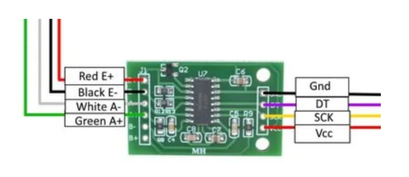

# Project Documentation

This directory contains the project documentation.

## Hardware Components

Below mentioned are some of the hardware components and some important  circuit diagrams - 

1. **Node MCU** 

   

2. **Heartbeat Sensor**

   

3. **Range Sensor**

   

4. **Load Cell**

   

5. **HMI Display**

   

## Circuit Diagrams

The circuit diagram for the whole project is shown below -

